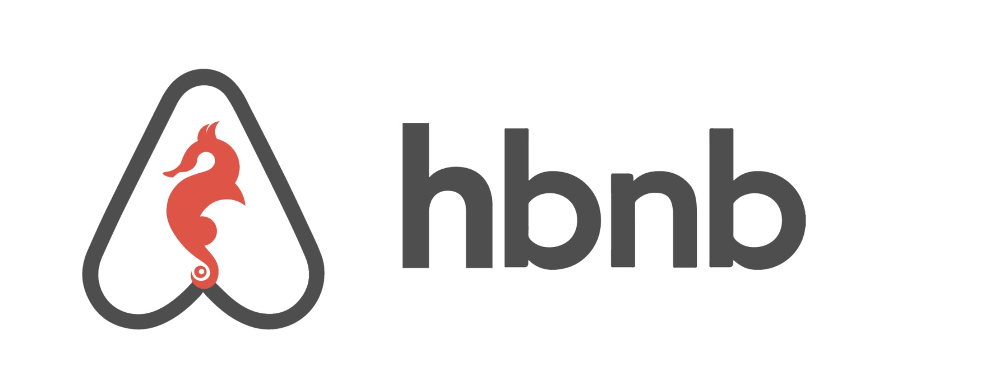

# 0x04. AirBnB clone - Web framework


Welcome to the Airbnb Clone project! This web application is a simplified version of the popular vacation rental platform, Airbnb. It is built using modern web development frameworks and technologies to provide a comprehensive and functional example of a full-stack web application.


## Resource :
[What is a web framework is ?](https://www.intelegain.com/what-are-web-frameworks-and-why-you-need-them)

## Tasks
#### 0. Hello Flask!

Write a script that starts a Flask web application:

- Your web application must be listening on `0.0.0.0`, port `5000`
- Routes:
    - `/`: display “Hello HBNB!”
- You must use the option `strict_slashes=False` in your route definition

```shell
guillaume@ubuntu:~/AirBnB_v2$ python3 -m web_flask.0-hello_route
* Running on http://0.0.0.0:5000/ (Press CTRL+C to quit)
....
```
In another tab:
```shell
guillaume@ubuntu:~$ curl 0.0.0.0:5000 ; echo "" | cat -e
Hello HBNB!$
guillaume@ubuntu:~$ 
```
##### Repo:

- GitHub repository: `AirBnB_clone_v2`
- Directory: `web_flask`
- File: `0-hello_route.py`, `__init__.py`

Write a script that starts a Flask web application:

- Your web application must be listening on `0.0.0.0`, port `5000`
- Routes:
    - `/`: display “Hello HBNB!”
    - /hbnb: display “HBNB”
- You must use the option `strict_slashes=False` in your route definition

```shelll
guillaume@ubuntu:~/AirBnB_v2$ python3 -m web_flask.1-hbnb_route
* Running on http://0.0.0.0:5000/ (Press CTRL+C to quit)
....
```
In another tab:
```shell
guillaume@ubuntu:~$ curl 0.0.0.0:5000/hbnb ; echo "" | cat -e
HBNB$
guillaume@ubuntu:~$ 
```

##### Repo:

- GitHub repository: `AirBnB_clone_v2`
- Directory: `web_flask`
- File: `1-hbnb_route.py`
